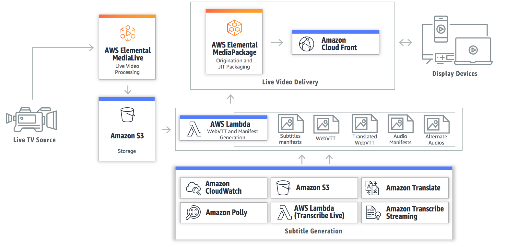
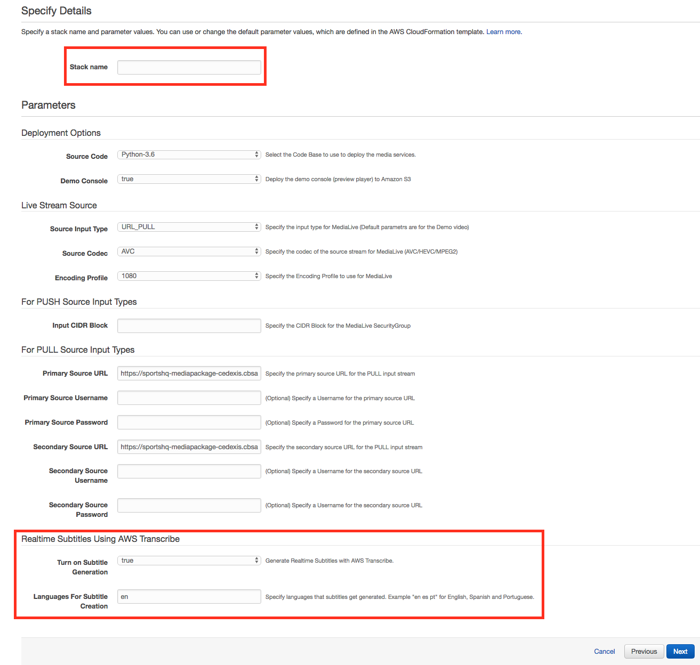

# Live Streaming with Automated Multi-Language Subtitling

Utilizes AWS Transcribe Streaming to create live captions for live video streaming. This solution uses AWS MediaLive as the encoder, AWS MediaPackage, Amazon Translate, Amazon Transcribe Streaming, Amazon S3, and Amazon Lambda. 

Navigate to [README](README.md) | [Workshop](WORKSHOP.md) | [Uninstall](UNINSTALL.md) |[TranscribeStreamingLambda](source/transcribelambda/) |  [CaptionCreationLambda](source/captionlambda/)

## On this Page
- [Architecture Overview](#architecture-overview)
- [Deployment](#deployment)
- [Pricing](#pricing)
- [Workflow Configuration](#workflow-configuration)
- [Additional Resources](#additional-resources)
- [Navigate](#navigate)

## Architecture Overview

## Deployment
The solution is deployed using a CloudFormation template with AWS Lambda backed custom resources. Follow the instructions below to deploy the solution.
To deploy this solution use one of the following CloudFormation templates.

#### Deploy with CloudFront CDN ~20 minutes   

#### Deploy in US-West-2 without CloudFront CDN <3 minutes (Faster to deploy than with CloudFront)   

Note that this solution uses AWS MediaLive, and AWS MediaPackage. So the CloudFormation will fail in regions that do not support these two services. Check at this link to see the supported regions. 
https://docs.aws.amazon.com/general/latest/gr/rande.html

Follow these steps to deploy your stack.

### Step 1: Start The CloudFormation

### Step 2: Setup The Stack

Choose any name for the stack. Then add a Primary and Secondary source URL.

Lastly make sure to choose the languages that you want AWS Transcribe Streaming to generate for the live stream.

Provide comma delimited language codes for the caption languages you want generated for your Live Stream.  
For example.

    en, es, pt
   
Here is list of the supported output subtitle languages. English is the only supported input audio language currently. 

	LANGUAGE_CODES = {
	    'ar': 'Arabic',
	    'zh': 'Chinese Simplified',
	    'zh-TW': 'Chinese Traditional',
	    'cs': 'Czech',
	    'da': 'Danish',
	    'nl': 'Dutch',
	    'en': 'English',
	    'fi': 'Finnish',
	    'fr': 'French',
	    'de': 'German',
	    'he': 'Hebrew',
	    'id': 'Indonesian',
	    'it': 'Italian',
	    'ja': 'Japanese',
	    'ko': 'Korean',
	    'pl': 'Polish',
	    'pt': 'Portuguese',
	    'ru': 'Russian',
	    'es': 'Spanish',
	    'sv': 'Swedish',
	    'tr': 'Turkish'
	}

### Step 3: Finish Starting the CloudFormation

Click the I accept button then click "Create" to start the stack.

### Step 4: Start AWS MediaLive Channel

For cost purposes the CloudFormation does not start the MediaLive Channel. 
Head over to the MediaLive console page and click the Start Button to start your channel.

The MediaLive Channel has to be started before you can start seeing a video stream. 

### Step 5: Watch The LiveStream

Under the outputs of the CloudFormation template get the MediaPackage endpoint to view the channel.

<b> After starting the MediaLive Channel and it has been playing for a minute check out your live stream here. Paste the HLS endpoint URL ending in m3u8 from the outputs in CloudFormation into this demo player page. </b>

[Video JS HLS Demo Player](https://videojs.github.io/videojs-contrib-hls/)

When you are done with the live event, stop the MediaLive channel. If you want zero cost after a live event delete the CloudFormation stack that you created in the CloudFormation console. The only items that should be left are a logs S3 Bucket and a captions S3 Bucket. You can delete these two items manually. Even if these buckets are left after a live stream thier cost is low. 

## Preview
Here is the solution using a free live broadcast as the input feed.

## Pricing 

You are responsible for the cost of the AWS services used while running this live streaming
solution. As of the date of publication, the cost for running this solution in the US East (N.
Virginia) Region is shown in the table below. The cost depends on the encoding profile you
choose, and does not include data transfer fees, the cost for the demo HTML preview
player, or Amazon CloudFront and AWS Elemental MediaPackage costs, which will vary
depending on the number of users and the types of end user devices.
	
	Encoding Profile Total Cost/Hour
	1080 (8 encodes) $5.00
	720 (7 encodes) $4.00
	540 (5 encodes) $2.25
	
	
Added costs for subtitle generation per input.

	Total Cost/Hour
	English $2.88
	Each Additional Language $1.50
	
[Amazon Transcribe Pricing](https://aws.amazon.com/transcribe/pricing/)
[Amazon Translate Pricing](https://aws.amazon.com/translate/pricing/)

Both input streams to AWS MediaLive get Transcribed with AWS Transcribe, this is for the input redundency feature. Each video stream transcribed by AWS Transcribe costs $1.44 per hour.

Note that pricing is per minute, with a minimum of 10 minutes. Prices are subject to
change. For full details, see the pricing webpage for each AWS service you will be using in
this solution.

## Encoding Profiles

Encoding Profiles
To solution Configures AWS Elemental MediaLive with one of three encoding profiles based on the source resolution defined at launch as a CloudFormation parameter. The three options are 1080, 720, 540 and correspond to the following encoding profiles:

### 1080p Profile: 
1080p@6500kbps, 720p@5000kbps, 720p@3300kbps, 540p@2000kbps, 432p@1200kbps, 360p@800kbps, 270@400kbps, 234p@200kbps.

### 720p Profile::
720p@5000kbps, 720p@3300kbps, 540p@2000kbps, 432p@1200kbps, 360p@800kbps, 270@400kbps, 234p@200kbps.

### 540p Profile::
540p@2000kbps, 432p@1200kbps, 360p@800kbps, 270@400kbps, 234p@200kbps.
	

## FAQ

#### PDF Guide to answer additional questions
[Live Streaming AWS PDF Guide](https://s3.amazonaws.com/solutions-reference/live-streaming/latest/live-streaming-on-aws.pdf)

#### Q. I want to run more than 2 AWS MediaLive channels ?

There is a default limit of 5 Amazon MediaLive channels per AWS account. But that can be increased from support. To run more than 2 channels using subtitles generated with Amazon Transcribe message AWS support to get your Amazon Transcribe limit increased. 

#### Q. What ingest formats does the solution support?

The solution can use all input formats that AWS Elemental MediaLive supports including Real-Time Transport Protocol (RTP) push, Real-Time Messaging Protocol (RTMP) push or pull, and HLS streams pull.

#### Q. I want to use RTMP PULL, or RTP PUSH?

In order to use RTMP_PULL you need to fill in the <b> Input CIDR block </b> field in the CloudFormation. Use the public ip address where your group RTMP stream is originating from. In addition if you want to be able to send an RTP input into your MediaLive from anywhere in the world use <b> 0.0.0.0/0 </b> in the field <b> Input CIDR block </b>

#### Q. I want low latency?

To minimize latency choose to use an RTP or RTMP input. In addition edit the MediaPackage channel HLS endpoint and change the segment size from 6 seconds to 2 seconds. Making these changes can yield under 20 seconds of end to end latency, where as without captions it yields under 10 seconds of latency. This is best case, different HTML5 players add different amounts of latency.  

#### Q. Does this solution support digital rights management (DRM)?

The solution does not support DRM at this time but it can be customized to support DRM. For an example of how to integrate DRM using Secure Packager and Encoding Key Exchange with AWS Elemental MediaPackage, see this GitHub repository.

#### Q. What resolutions does this solution support?

The solution includes the following output resolutions: 1080p at 6500kbps, 720p at 5000kbps and 3300kbps, 540p at 2000kbps, 432p at 1200kbps, 360p at 800kbps, 270p at 400kbps, and 234p at 200kbps.

## Additional Resources

## License

This solution is licensed under the Apache 2.0 License.

## Navigate

Navigate to [README](README.md) | [Workshop](WORKSHOP.md) | [Uninstall](UNINSTALL.md) |[TranscribeStreamingLambda](source/transcribelambda/) |  [CaptionCreationLambda](source/captionlambda/)
